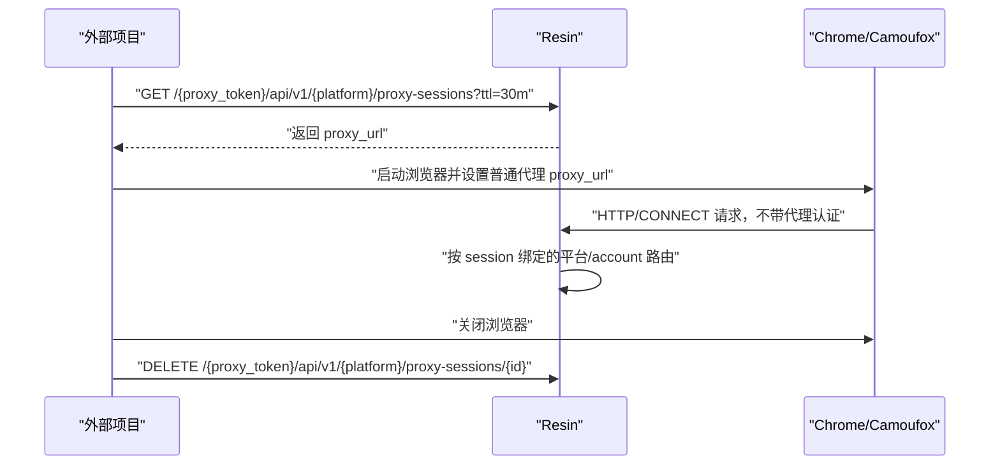

# 浏览器代理会话对接指南

## 适用场景

浏览器代理会话用于解决 Chrome/CDP 无法直接使用带认证代理的问题。

外部项目每次启动浏览器前调用 Resin 创建一个临时本地代理地址，例如：

```text
http://127.0.0.1:23127
```

浏览器只需要把它当成普通 HTTP 代理使用，不需要设置 `Proxy-Authorization`。Resin 会在服务内部把该本地端口固定绑定到指定平台、自动生成的账号和轮询选中的代理节点。

## 核心流程



## 创建代理会话

```http
GET /{proxy_token}/api/v1/{platform}/proxy-sessions
```

示例：

```bash
curl -sS "http://127.0.0.1:9200/admin2012/api/v1/Default/proxy-sessions?ttl=30m"
```

响应示例：

```json
{
  "id": "6f4e1b7d-7fd7-4c48-a76b-29f0c40a4d20",
  "platform_name": "Default",
  "account": "15cfc4c2-43fd-4ad8-9a2e-f9d53f9c8f74",
  "proxy_url": "http://127.0.0.1:23127",
  "node_hash": "0005baaac802d58a1296c33fac28c3a2",
  "egress_ip": "1.2.3.4",
  "ttl": "30m0s",
  "expires_at": "2026-06-30T12:00:00Z"
}
```

响应头会包含：

```http
Cache-Control: no-store
```

该接口是有副作用的 GET：每次调用都会创建一个新的代理会话。

## 请求参数

| 参数 | 位置 | 必填 | 说明 |
|---|---|---:|---|
| `proxy_token` | path | 是 | Resin 的代理 Token。 |
| `platform` | path | 是 | 平台名称，例如 `Default`、`MyPlatform`。 |
| `ttl` | query | 否 | Go duration 字符串，例如 `30m`、`2h`、`45s`。不传时使用目标平台的 `sticky_ttl`。 |
| `format` | query | 否 | 设置为 `url` 时只返回纯文本 `proxy_url`。 |

`ttl` 必须是正数。非法、零值或负数会返回 `400 INVALID_ARGUMENT`。

## 简化 URL 输出

如果调用方只想像读取普通代理地址一样使用：

```bash
curl -sS "http://127.0.0.1:9200/admin2012/api/v1/Default/proxy-sessions?format=url&ttl=30m"
```

响应：

```text
http://127.0.0.1:23127
```

这种模式不会返回 session `id`，调用方无法主动释放，只能依赖 TTL 自动回收。因此建议配合较短的 `ttl` 使用。

## 使用代理启动浏览器

### Playwright 示例

```ts
import { chromium } from "playwright";

async function createProxySession() {
  const res = await fetch(
    "http://127.0.0.1:9200/admin2012/api/v1/Default/proxy-sessions?ttl=30m",
    { cache: "no-store" },
  );
  if (!res.ok) {
    throw new Error(`create proxy session failed: ${res.status} ${await res.text()}`);
  }
  return await res.json() as {
    id: string;
    proxy_url: string;
  };
}

async function releaseProxySession(id: string) {
  const res = await fetch(
    `http://127.0.0.1:9200/admin2012/api/v1/Default/proxy-sessions/${id}`,
    { method: "DELETE" },
  );
  if (!res.ok && res.status !== 404) {
    throw new Error(`release proxy session failed: ${res.status} ${await res.text()}`);
  }
}

const session = await createProxySession();

try {
  const browser = await chromium.launch({
    proxy: {
      server: session.proxy_url,
    },
  });

  try {
    const page = await browser.newPage();
    await page.goto("https://api.ipify.org?format=json");
    console.log(await page.textContent("body"));
  } finally {
    await browser.close();
  }
} finally {
  await releaseProxySession(session.id);
}
```

### Chrome 命令行示例

```bash
proxy_url="$(curl -sS 'http://127.0.0.1:9200/admin2012/api/v1/Default/proxy-sessions?format=url&ttl=10m')"

google-chrome \
  --proxy-server="$proxy_url" \
  --user-data-dir="/tmp/resin-browser-profile-$$"
```

命令行方式如果使用 `format=url`，关闭浏览器后无法主动释放 session，建议传短 TTL。

## 释放代理会话

```http
DELETE /{proxy_token}/api/v1/{platform}/proxy-sessions/{id}
```

示例：

```bash
curl -sS -X DELETE \
  "http://127.0.0.1:9200/admin2012/api/v1/Default/proxy-sessions/6f4e1b7d-7fd7-4c48-a76b-29f0c40a4d20"
```

成功响应：

```json
{
  "status": "ok"
}
```

以下情况返回 `404 NOT_FOUND`：

- session 不存在；
- session 已经过期；
- DELETE 路径中的平台与 session 创建平台不一致。

## 分配与回收规则

- 每个 session 独占一个本地监听端口。
- 本地端口只监听 `127.0.0.1`。
- 端口默认从 `20000-40000` 中随机选择。
- 每次创建最多尝试 64 个随机端口。
- 端口不可用或达到活跃 session 上限时返回 `409 CONFLICT`。
- 默认最大活跃 session 数为 1000。
- 每个平台独立维护轮询游标。
- 节点按 `node_hash` 稳定排序后轮询选择。
- 节点允许复用，因此效果类似 `A/B/C/A/B`。
- DELETE 会关闭本地端口并删除对应 lease。
- TTL 到期会自动执行同样的清理逻辑。
- Resin 进程关闭时会释放所有活跃 session listener。

## 推荐对接方式

推荐外部项目使用 JSON 模式：

1. 启动浏览器前创建 session。
2. 使用返回的 `proxy_url` 作为普通 HTTP 代理。
3. 保存返回的 `id`。
4. 浏览器关闭后在 `finally` / defer 中 DELETE。
5. 同时设置合理 TTL 作为兜底，例如 `30m`。

不推荐长期使用 `format=url` 创建长 TTL session，因为该模式没有 `id`，调用方无法主动释放端口。

## 常见错误

| HTTP 状态 | 错误码 | 常见原因 |
|---:|---|---|
| 400 | `INVALID_ARGUMENT` | `ttl` 非法、为零或为负数。 |
| 404 | `NOT_FOUND` | 平台不存在、session 不存在、session 已过期或平台不匹配。 |
| 409 | `CONFLICT` | 活跃 session 达到上限，或随机端口尝试耗尽。 |
| 502 | `BAD_GATEWAY` / 上游错误 | session 已创建，但所选代理节点访问目标站点失败。 |

## 最小对接清单

- 创建接口必须每次启动浏览器前调用一次，不要缓存响应。
- 客户端侧也应禁用缓存，或至少不要复用旧的 `proxy_url`。
- 浏览器只配置 `proxy_url`，不要再配置代理用户名密码。
- 优先使用 JSON 模式，确保关闭浏览器后 DELETE。
- `format=url` 只适合脚本快速接入，并应设置较短 TTL。
